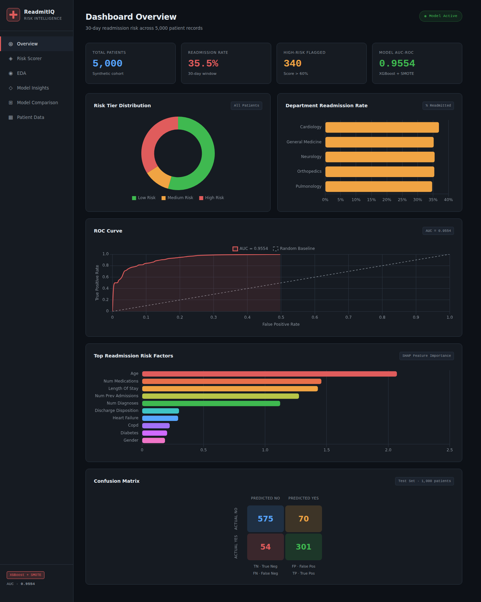
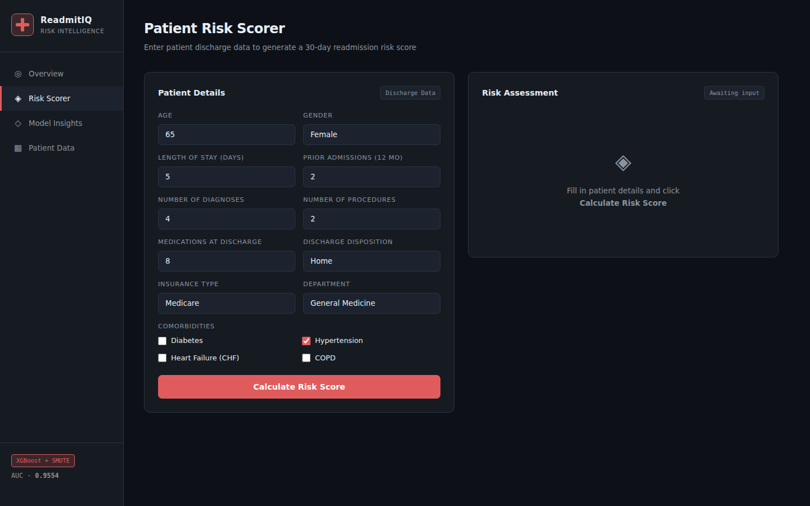
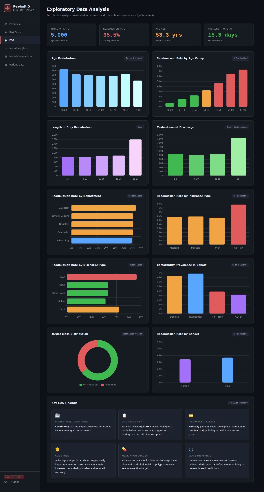
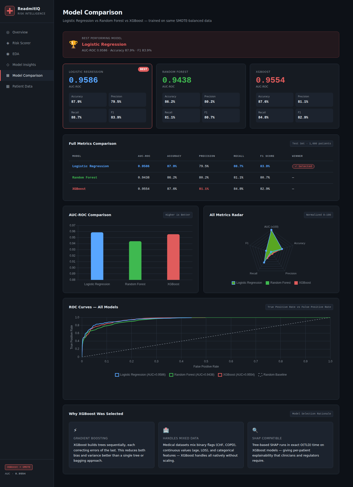
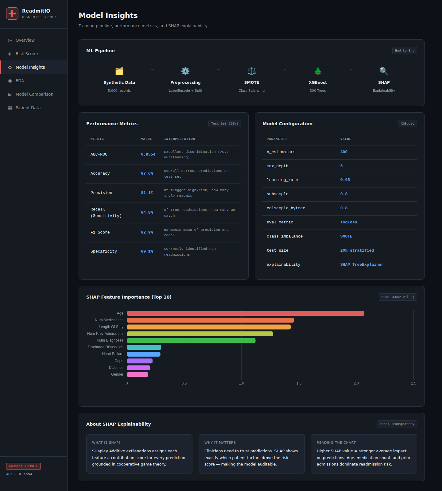
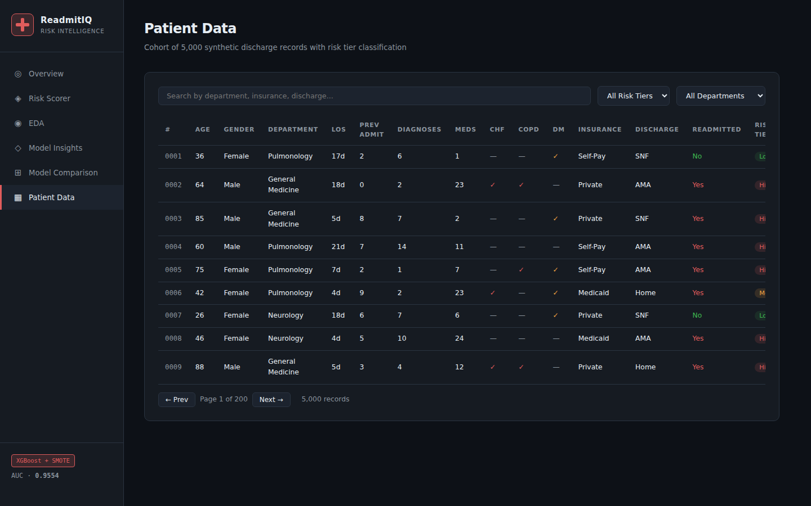

# 🏥 ReadmitIQ — Hospital Readmission Risk Scorecard

Hospitals often struggle to identify which patients are likely to be readmitted within 30 days of discharge — a costly, high-stakes problem tied to both patient outcomes and CMS reimbursement penalties. **ReadmitIQ** uses machine learning, explainable AI (SHAP), SQL analytics, and an interactive dashboard to estimate 30-day readmission risk and surface the clinical factors driving it, so care teams can prioritize follow-up for the patients who need it most.

<p align="center">
  
</p>

<p align="center">
  
  
</p>

<p align="center">
  
  
</p>

<p align="center">
  
</p>

[](https://saranya22-git.github.io/ReadmitIQ---Hospital-Readmission-Risk-Scorecard/)


---

## 💡 Business Impact

- Flags high-risk patients **before discharge**, giving care teams time to intervene
- Supports better discharge planning and post-discharge follow-up scheduling
- Helps reduce avoidable 30-day readmissions and associated penalty exposure
- Gives resource-allocation teams a data-backed way to prioritize care management staff
- Demonstrates explainable AI (SHAP) so clinicians can see *why* a patient is flagged, not just that they are

## ✨ Key Features

- ✔ Predicts 30-day readmission risk for individual patients
- ✔ Explains every prediction with SHAP feature attributions
- ✔ Compares three ML algorithms head-to-head (Logistic Regression, Random Forest, XGBoost)
- ✔ Interactive risk scorer — enter patient details, get a live score + clinical note
- ✔ 12 SQL analytical queries for readmission patterns
- ✔ Power BI integration guide
- ✔ Synthetic 5,000-patient healthcare dataset with realistic clinical logic
- ✔ Responsive, multi-page dashboard (no backend required)

## 📊 Model Results

| Metric    | Value  |
| --------- | ------ |
| AUC-ROC   | 0.9554 |
| Accuracy  | 87.6%  |
| F1 Score  | 82.9%  |
| Precision | 81.1%  |
| Recall    | 84.8%  |

## 🥇 Model Comparison — Why XGBoost?

| Model                | AUC-ROC | Accuracy | Precision | Recall | F1    |
| --------------------- | ------- | -------- | --------- | ------ | ----- |
| Logistic Regression   | 0.9586  | 87.9%    | 79.5%     | 88.7%  | 83.9% |
| Random Forest          | 0.9438  | 86.2%    | 80.2%     | 81.1%  | 80.7% |
| **XGBoost (selected)** | 0.9554  | 87.6%    | **81.1%** | 84.8%  | 82.9% |

Logistic Regression edges out XGBoost on raw AUC-ROC, but XGBoost was selected as the production model because it gives the **best precision** (fewer false alarms for care teams to chase) while still keeping recall high, captures non-linear interactions between comorbidities and length-of-stay that a linear model misses, and handles mixed categorical/numeric clinical features natively without heavy preprocessing.

## 🏗 Architecture

```
Synthetic Patient Data (5,000 records)
        │
        ▼
Preprocessing (Label Encoding)
        │
        ▼
Train/Test Split (80/20, stratified)
        │
        ▼
SMOTE (class imbalance correction)
        │
        ▼
Train: Logistic Regression · Random Forest · XGBoost
        │
        ▼
Evaluation (AUC-ROC, Precision, Recall, F1, Confusion Matrix)
        │
        ▼
SHAP TreeExplainer (feature attribution)
        │
        ▼
Export → model_data.js / comparison_data.js
        │
        ▼
Website Dashboard (6-page static site)
```

## 🗂 Dataset

5,000 synthetic patient records generated with clinically-informed probability logic (higher age, prior admissions, comorbidity count, and AMA discharge all increase readmission likelihood).

| Feature | Description |
|---|---|
| `age` | Patient age (18–90) |
| `gender` | Male / Female |
| `length_of_stay` | Days admitted (1–30) |
| `num_prev_admissions` | Prior admissions in past 12 months |
| `num_diagnoses` | Number of diagnoses on record |
| `num_procedures` | Procedures performed during stay |
| `num_medications` | Medications at discharge |
| `diabetes`, `hypertension`, `heart_failure`, `copd` | Binary comorbidity flags |
| `discharge_disposition` | Home / Home Health / SNF / Rehab / AMA |
| `insurance_type` | Medicare / Medicaid / Private / Self-Pay |
| `department` | Cardiology / General Medicine / Pulmonology / Orthopedics / Neurology |
| `readmitted_30d` | **Target** — readmitted within 30 days (0/1) |

## 🛠 Tech Stack

| Layer           | Technology                                          |
| --------------- | ---------------------------------------------------- |
| Data Generation | Python, NumPy, Pandas                               |
| ML Pipeline     | XGBoost, Logistic Regression, Random Forest         |
| Class Imbalance | SMOTE (imbalanced-learn)                            |
| Explainability  | SHAP TreeExplainer                                  |
| SQL Analysis    | 12 analytical queries (PostgreSQL/MySQL compatible) |
| Visualization   | Chart.js 4.4, Power BI                              |
| Frontend        | HTML5, CSS3, Vanilla JS                             |

## 🖥 Interactive Dashboard Modules (6 Pages)

| Page                          | Description                                                     |
| ----------------------------- | ----------------------------------------------------------------- |
| `index.html`                  | Dashboard — KPIs, ROC curve, SHAP chart, confusion matrix         |
| `pages/eda.html`              | EDA — 10 charts: age, LOS, meds, dept, insurance, comorbidities   |
| `pages/risk-scorer.html`      | Live patient form → 30-day risk score + clinical note             |
| `pages/model-insights.html`   | ML pipeline, performance metrics, SHAP explainability             |
| `pages/model-comparison.html` | LR vs RF vs XGBoost — radar, ROC, metrics table                   |
| `pages/patient-data.html`     | Searchable/filterable 5,000-patient cohort table                  |

## 📁 Folder Structure

```
hospital-readmission-risk/
├── data/
│   └── hospital_readmission.csv       ← 5,000 synthetic records
├── model/
│   ├── generate_and_train.py          ← Full ML pipeline
│   └── xgb_readmission.pkl            ← Trained XGBoost model
├── queries/
│   └── readmission_analysis.sql       ← 12 SQL analytical queries
├── powerbi/
│   └── README.md                      ← Step-by-step Power BI guide
├── website/
│   ├── index.html                     ← Main dashboard
│   ├── css/style.css
│   ├── js/
│   │   ├── dashboard.js
│   │   ├── model_data.js              ← XGBoost artifacts (JSON)
│   │   ├── eda_data.js                ← EDA statistics (JSON)
│   │   └── comparison_data.js         ← Model comparison results (JSON)
│   └── pages/
│       ├── eda.html
│       ├── risk-scorer.html
│       ├── model-insights.html
│       ├── model-comparison.html
│       └── patient-data.html
├── assets/
│   └── screenshots/                   ← README screenshots (add your own)
├── requirements.txt
├── LICENSE
├── .gitignore
└── README.md
```

## 🚀 Installation & Usage

```bash
# Step 1: Clone and install dependencies
git clone https://github.com/Saranya22-git/ReadmitIQ---Hospital-Readmission-Risk-Scorecard.git
cd ReadmitIQ---Hospital-Readmission-Risk-Scorecard
pip install -r requirements.txt

# Step 2: Generate data & train all models
cd model
python generate_and_train.py

# Step 3: Open the website
open ../website/index.html   # Mac
# or double-click index.html in File Explorer (Windows)
```

**[🔗 Live Demo](https://saranya22-git.github.io/ReadmitIQ---Hospital-Readmission-Risk-Scorecard/)** *(enable GitHub Pages in repo Settings to activate this link — see note below)*

## 📈 Business Insights Generated (12 SQL Queries)

- Overall readmission rate
- Readmission by department (ranked)
- Avg LOS by readmission status
- High-risk patient flagging
- Insurance type analysis
- Discharge disposition analysis
- Age-band breakdown
- Comorbidity combination risk
- Department × Insurance segment
- Running readmission rate (window function)
- Polypharmacy risk tiers
- AMA discharge segment analysis

## 🔮 Future Improvements

- Deploy as a live prediction API (Flask/FastAPI)
- Add authentication for clinician-facing use
- Docker support for one-command setup
- Cloud deployment (Render/Railway/Azure)
- Integrate with real EHR data pipelines (FHIR standard)

## 📄 License

This project is licensed under the MIT License — see [LICENSE](LICENSE) for details.

## 👤 Author

**Saranya Sammeta** | B.Tech CSE (AI & Data Science) | CGPA 9.15
GitHub: [github.com/Saranya22-git](https://github.com/Saranya22-git) | LinkedIn: [linkedin.com/in/sammeta-saranya-5517a8311](https://linkedin.com/in/sammeta-saranya-5517a8311)
